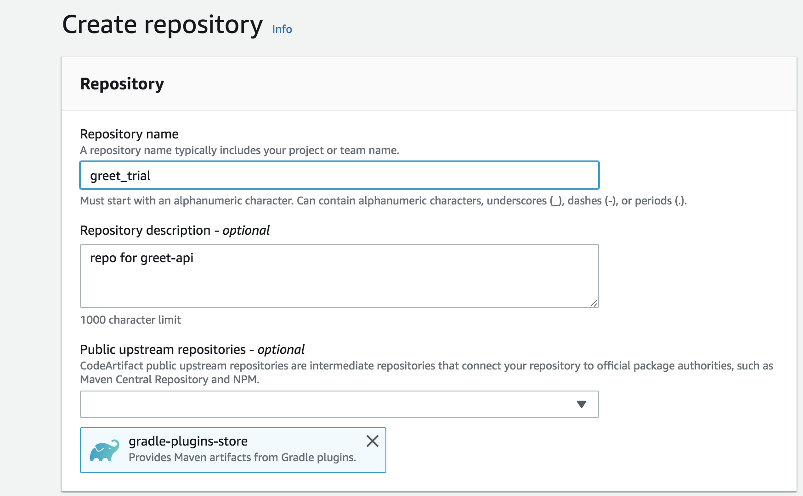
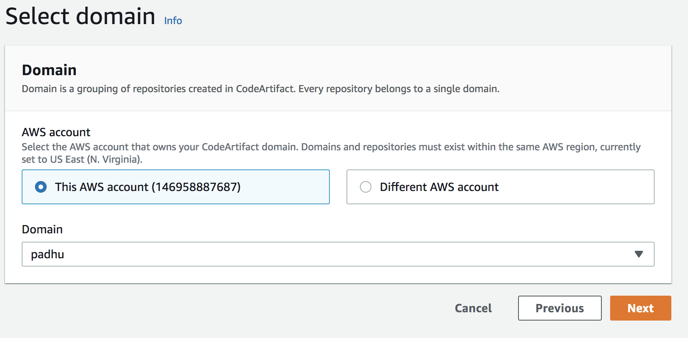
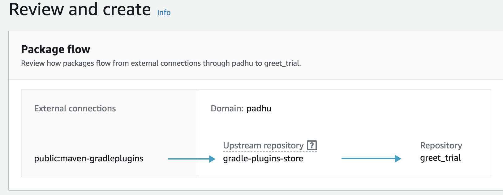

### Clone repo
Here we clone the repo into current local directory using the following with ssh enabled
      ```git clone git@github.com:manosenthill/greet-api.git```
### Gradle build

We should make sure we are inside the project by 
```$ cd greet-api```

once we are in the root of the project build our application using `./gradlew clean build`

after succesful build, Jar file is created under `/build/libs/` directory.  

### Publish artifact

we are going to publish our artifact into artifact repo.There are numerous artifact repo in market. Here we are going to publish it in AWS CodeArtifact. 

Login to AWS console and navigate to `Code Artifact` to create repository

1. Create Domain
2. Create Repositories



3. make sure that user has AWSCodeArtifactAdminAccess IAM policy Attached.
4. export AUTH_TOKEN
```$ export CODEARTIFACT_AUTH_TOKEN=`aws codeartifact get-authorization-token --domain mano --domain-owner 146958887```
5. add the maven-publish plugin to the plugins section of the project's ```build.gradle``` file.

```
plugins {
    id 'java'
    id 'maven-publish'
}
```

add a publishing section to the project build.gradle file.

```
publishing {
  publications {
      mavenJava(MavenPublication) {
          groupId = 'org.myorg'
          artifactId = 'greet-api'
          version = '1.0'
          from components.java
      }
}
  repositories {
      maven {
          url 'https://mano-146958887687.d.codeartifact.us-east-1.amazonaws.com/maven/greet_trial/'
          credentials {
              username "aws"
              password System.env.CODEARTIFACT_AUTH_TOKEN
          }
```

We have to specify groupid,artifactId and version.

The maven-publish plugin generates a POM file based on the groupId, artifactId, and version specified in the publishing section.

After these changes to `build.gradle` are complete, run the following command to build the project and upload it to the repository `./gradlew publish`

verify the artifact in code artifact.

